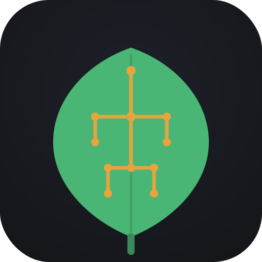

  

<h1 align="center">Furrow</h1>

<i>Agriculture IoT platform - built on ESP32 + Firebase</i>

Furrow started as a single retrofit: remote control for one farm
pump's 3-phase Star-Delta starter. It's now the base for a broader
agriculture IoT platform - same firmware/dashboard/backend
architecture, extended module by module rather than rebuilt each time.

**Motor Control is the first module, and the only one built so far** -
everything below describes that module specifically. See
[Roadmap](#roadmap) for what's planned to join it.

**Live dashboard:** [furrow-123098.web.app](https://furrow-123098.web.app)

---

## Module: Motor Control

Remote monitoring and control for a 3-phase Star-Delta (or DOL) motor
starter.

An ESP32, wired to a 2-channel relay, simulates the physical Start and
Stop pushbuttons on an existing starter panel. The ESP32 never touches
the main contactor coils directly - it only interfaces with the same
low-voltage control loop a person would use by pressing the buttons
themselves.

- **No rewiring of the starter panel.** It's a retrofit, not a
  replacement - manual operation at the panel keeps working exactly
  as before.
- **The ESP32 stays electrically isolated from mains.** It reads and
  writes only low-voltage signals; anything touching the 415-440V
  side was deliberately designed around non-invasive or isolated
  components. See [A note on safety](#a-note-on-safety).

Control and monitoring happen through a web dashboard backed by
Firebase - no app to install, works on desktop or phone.

---

## Features

**Control**
- Remote Start/Stop, simulating the physical pushbuttons
- Remote Restart (Shutdown exists in firmware but isn't exposed in
  the dashboard - the one command with no remote way back)
- Manual OTA firmware updates from the dashboard, with live progress
  (percentage + phase) on both the dashboard and Serial

**Connectivity & setup**
- WiFi and device setup via a SoftAP + captive portal
  (`Furrow-Setup-XXXX`) - no laptop/USB needed after the initial
  flash, works the same on iPhone, Android, and desktop
- Device name, owner email, and optional WhatsApp alert recipient are
  also set through the same portal - one firmware binary works for
  any device or owner
- Automatic WiFi/Firebase reconnect with an auth watchdog

**Multi-device, multi-user**
- MAC-based device identity - multiple boards run identical firmware
  without colliding in Firebase
- Each device is tied to an owner's email, enforced by Firebase Auth
  + RTDB rules - friends can share one Firebase project and each only
  see/control their own device(s)

**Dashboard**
- Installable PWA - works like an app from your phone's home screen
- Live status with a server-authoritative "last seen" timestamp -
  accurate from the first page load, not dependent on a browser
  having been open to observe it
- Device rename, inline
- "Update available" badge when a device's firmware is behind the
  latest release

**Alerts**
- Optional WhatsApp alerts (via [Whapi.cloud](https://whapi.cloud))
  for device/connectivity health events - opt-in per device, no
  effect on anything else if left unconfigured

**Release process**
- Semantic versioning, documented in [CHANGELOG.md](CHANGELOG.md)
- Firmware: tag a version → GitHub Actions builds it and publishes a
  GitHub Release with the `.bin` attached, automatically
- Dashboard: push a change to `web/` on `main` → deploys to Firebase
  Hosting automatically, independent of firmware releases
- The dashboard's OTA update always points at the latest published
  firmware release
- No credentials of any kind are ever committed - see
  [Secrets](#secrets)

---

## Not done yet

- **Real motor feedback.** Motor state is currently *command-based* -
  assumed from the last relay pulse, not observed from real current
  flow. A manual Start/Stop press at the physical panel isn't
  reflected on the dashboard yet. A non-invasive current sensor
  (SCT-013-010) is the planned fix.
- **Phase-loss / incoming supply monitoring.** Likely via the existing
  single-phasing preventer's spare fault contact, rather than adding
  new voltage-sensing hardware.
- **Motor-fault WhatsApp alerts.** The alert system exists (device
  health, OTA events); motor-specific alerts are blocked on real
  motor feedback landing first.
- **Second controller (Star-Delta unit)** hasn't been through the
  same hardening pass as the first (DOL) controller yet.
- **Remote factory reset.** Exists locally (see `src/main.cpp` for
  the WiFi-reconfigure procedure), not yet a dashboard command.

## Roadmap

Future modules under consideration, not started:
- Well water level monitoring
- Irrigation gate valve control
- Flow rate sensing, energy/runtime tracking

---

## Getting started

Full step-by-step setup is in **[SETUP.md](SETUP.md)** - roughly
20-30 minutes, mostly one-time Firebase Console clicks. Shape of it:

1. Create a Firebase project (Realtime Database + Authentication)
2. Copy `include/secrets.example.h` → `include/secrets.h`, fill in
   your values (never committed - see [Secrets](#secrets))
3. Flash once via USB (PlatformIO)
4. Connect to `Furrow-Setup-XXXX`, complete setup from a browser
5. Open the dashboard, sign in, done

## Secrets

Nothing that grants write access or costs money on someone else's
account is ever committed:

- `include/secrets.h` (firmware) and `web/firebase-config.js`
  (dashboard) are both gitignored - copy from their `.example`
  templates for local builds
- CI generates both, plus `.firebaserc`, at build/deploy time from
  GitHub Actions repository secrets - never appear in any commit or log

**One exception worth understanding:** Firebase Web API keys *are*
meant to be public in client-side code - Google's security model puts
the real boundary at Firebase Security Rules, not at hiding that key.
What genuinely matters to keep secret is the device account password
and the WhatsApp sender token - both live in `secrets.h`.

---

## Tech stack

- **Firmware:** ESP32 (Arduino, PlatformIO), FirebaseClient (mobizt)
- **Backend:** Firebase Realtime Database + Authentication (Email/Password)
- **Dashboard:** Vanilla JS + Firebase Web SDK, installable PWA
- **CI/CD:** GitHub Actions - firmware release on tag push, dashboard
  deploy on `web/` push to `main`

---

## A note on safety

This project intentionally keeps the ESP32 away from anything above
low voltage. Relay outputs simulate pushbuttons rather than switching
contactor coils directly; sensing work stays non-invasive (clamp-on
current sensors) or isolated. If you're adapting this for your own
panel, treat anything touching mains voltage as electrician territory,
not a wiring diagram to follow alone - this applies to every future
module too, not just Motor Control.
