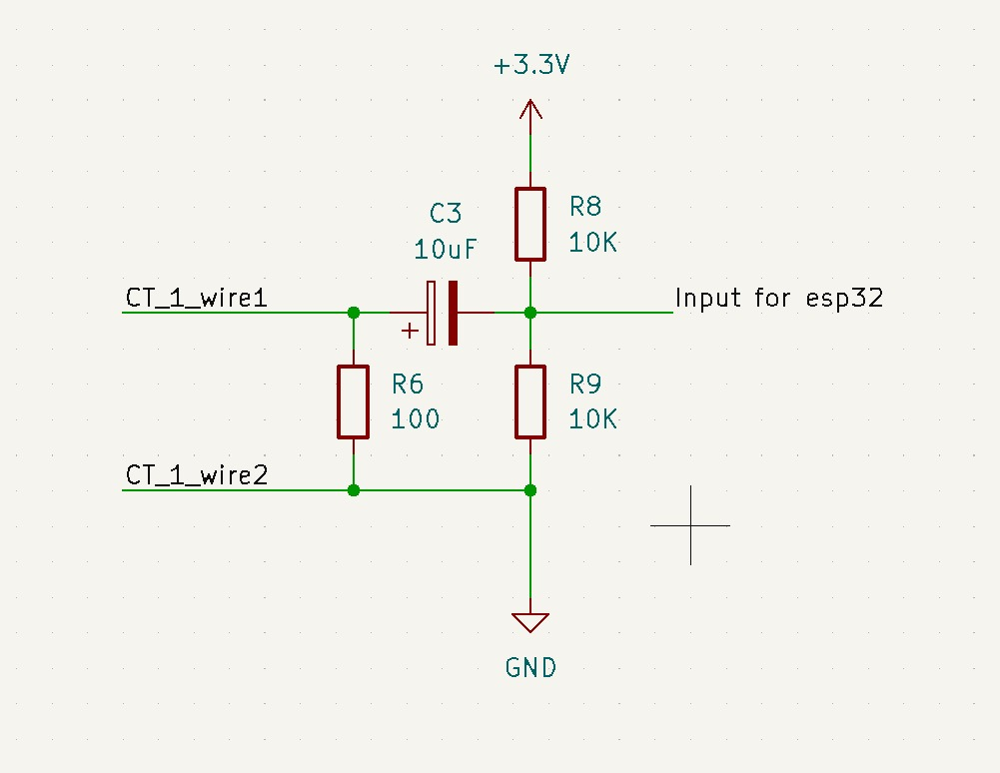

  

<h1 align="center">Furrow</h1>

<i>Agriculture IoT platform - built on ESP32 + Firebase</i>

**Live dashboard:** [furrow-123098.web.app](https://furrow-123098.web.app)

---

## Overview

Furrow lets you turn a farm pump's motor on and off from your phone,
from anywhere, and get a text-style alert if the pump loses power. A
small computer board (an **ESP32**) sits next to your existing motor
starter panel and presses the Start/Stop buttons for you - it doesn't
rewire or replace anything in the panel, it just adds a remote way to
press the same buttons a person would press by hand.

It started as a one-off for a single pump. It's now meant to grow into
a small platform for other farm sensors too (water level, irrigation
valves, etc.) - see [Roadmap](#roadmap) - but **Motor Control is the
only piece built so far**, and everything below describes that.

If any term below is unfamiliar, check the [Glossary](#glossary) - it
covers every acronym and hardware term used in this README.

---

## Module: Motor Control

**What it does:** remote Start/Stop and live status for a 3-phase
Star-Delta (or DOL) motor starter, plus real feedback on whether the
motor is actually running - not just "we told it to start."

**How it does it, physically:** the ESP32 is wired to a 2-channel
relay module. A relay is just an electronically-controlled switch -
when the ESP32 tells it to, it briefly closes a connection, exactly
like a finger pressing a button. The relay's two channels are wired in
parallel with the panel's existing physical Start and Stop pushbuttons
- so pressing the button in person still works exactly as before, and
the ESP32 is just a second way to trigger the same thing.

**Tested working on both a DOL and a Star-Delta starter.** The
Star-to-Delta transition timing is handled entirely by the starter
panel's own existing timer relay, the same as it would be for a manual
button press - the firmware doesn't need to know or care which type of
starter it's talking to, because it's only ever pressing buttons, never
controlling the motor directly.

- **No rewiring of the starter panel.** This is a retrofit that sits
  alongside the existing panel, not a replacement for it.
- **The ESP32 never touches mains voltage.** It only ever reads and
  writes small, safe voltages (typically 3.3V-5V). Everything
  touching the panel's real 415-440V wiring was deliberately kept
  either non-invasive (like the current sensor, which clips around a
  wire without touching it) or fully isolated. See
  [A note on safety](#a-note-on-safety).

You control and monitor it all from a web dashboard - no app to
install, works from a phone or a laptop browser.

### Wiring

| ESP32 pin | Connects to | Notes |
|---|---|---|
| GPIO26 | Relay module IN1 (Start channel) | Active-LOW - the ESP32 briefly pulls this pin LOW to simulate a button press |
| GPIO27 | Relay module IN2 (Stop channel) | Active-LOW, same idea as above |
| 5V | Relay module VCC | Power for the relay module |
| GND | Relay module GND | Shared ground - always connect this between two boards talking to each other |
| 3.3V | CT sensor circuit - left pin of its 3-pin header | Powers the bias/coupling circuit - see [Current-sensor feedback](#current-sensor-feedback-1-channel) below |
| GND | CT sensor circuit - middle pin of its 3-pin header | Shared ground for the CT circuit |
| GPIO34 (ADC1) | CT sensor circuit - right pin of its 3-pin header | Current sensor signal in - `Config::CURRENT_ADC_PIN`, see [Current-sensor feedback](#current-sensor-feedback-1-channel) below |

The relay's Start/Stop channels wire into the starter panel's existing
low-voltage control loop, in parallel with the physical pushbuttons -
never into the main contactor coils or anything carrying 415-440V
directly. See [A note on safety](#a-note-on-safety).

### Enclosure

[ESP32 (WROOM) + dual-channel relay module case](https://makerworld.com/en/models/681746-esp32-wroom-dual-channel-relay-module-case)
by Tomek550 - free 3D-printable, fits this exact hardware pairing.
Both boards mount with M3 screws, snap-on lid, cutouts for the USB-C
port, relay cables, and serial pins. ~1.2h print time.

---

## What it can do today

**Control**
- Turn the motor on/off remotely, exactly as if pressing the physical
  buttons
- Restart the ESP32 itself remotely
- Update the firmware over WiFi ("OTA" - see [Glossary](#glossary)),
  straight from the dashboard, with a live progress bar

**Setup - no laptop needed after the first flash**
- The very first time, the ESP32 broadcasts its own temporary WiFi
  network (`Furrow-Setup-XXXX`). Connect to it from your phone, fill
  in a small web form with your real WiFi details, and it's done -
  works the same on iPhone, Android, or a laptop
- The same form also sets the device's name, your email (so the
  dashboard knows it's yours), and an optional phone number for
  WhatsApp alerts
- If WiFi or the connection to Firebase ever drops, it reconnects on
  its own

**Sharing one setup with multiple people/devices**
- Every ESP32 board identifies itself uniquely (using its built-in MAC
  address, a serial number every network chip has), so multiple
  devices can share the same Firebase project without conflicting
- Each device is tied to one owner's email. Firebase's own security
  rules enforce that people can only ever see and control their own
  device(s), even though everyone's using the same shared project

**Dashboard**
- Installable as an app icon on your phone's home screen (a "PWA" -
  see [Glossary](#glossary))
- Shows live status, including exactly how long ago the device last
  checked in
- Clearly flags "No Power" after 30 seconds of silence from a device -
  a real proxy for the pump having lost power, not just a generic
  "offline" label (see [How power-loss detection works](#how-power-loss-detection-works)
  below)
- Rename a device right from the dashboard
- Shows an "Update available" badge if a device is running older
  firmware than the latest release

**Motor feedback (real, not assumed)**
- A current sensor (a "CT sensor" - see [Glossary](#glossary)) clips
  around one of the motor's wires and measures whether current is
  actually flowing
- This means the dashboard reflects **reality**, not just "what we
  last told it to do": if someone presses the physical Start button
  at the panel, or the motor trips/stops on its own, the dashboard
  updates to match - not just remote commands
- See [Current-sensor feedback](#current-sensor-feedback-1-channel)
  below for the full wiring/calibration guide

**Alerts (optional)**
- WhatsApp alerts via [Whapi.cloud](https://whapi.cloud) - entirely
  opt-in per device, no effect on anything if you skip it
- If WiFi drops for 30 seconds or longer (but the device stays
  powered), you get a message the moment it reconnects, saying how
  long it was gone
- **Real power-loss alerts**, even when the device is fully switched
  off and can't report anything itself: a small program running on
  Google's own servers (a "Cloud Function" - not on the ESP32 itself)
  checks in on every device roughly once a minute, independent of the
  device. If one's gone quiet, it sends the alert. This piece needs
  Firebase's paid "Blaze" plan - see [SETUP.md](SETUP.md) step 8 for
  why that's still effectively free at this scale
- **Browser/PWA push notifications**, alongside WhatsApp, for the same
  three events: power loss, power restored, and the motor starting or
  stopping (including a physical button press at the panel, not just
  remote commands - this comes from the same real current-sensor
  feedback as everything else). Enabled per device, from that
  device's own panel on the dashboard - see
  [SETUP.md step 11](SETUP.md#11-push-notifications-optional)

**Releases**
- Every version is documented in [CHANGELOG.md](CHANGELOG.md)
- Tag a firmware version → GitHub automatically builds it and
  publishes a downloadable release
- Push a dashboard change → it goes live automatically, independent of
  firmware releases
- No passwords or API keys are ever stored in the code itself - see
  [Secrets](#secrets)

---

## How power-loss detection works

The ESP32's own power comes through the same protective device that
already guards the motor (a "digital single-phasing preventer" - a
safety box that cuts power if it detects a wiring fault). So if that
device trips, the ESP32 loses power too, at the same moment. The
dashboard uses exactly that: if a device goes silent for 30+ seconds,
it's shown as "No Power" rather than a generic "offline," because in
practice that's almost always what actually happened.

**Not yet done:**
- **Motor-fault alerts.** Alerts currently cover device health,
  firmware updates, and power loss - not "the motor itself started or
  stopped unexpectedly." Not planned for the near term.
- **Remote factory reset** exists as a command but hasn't been
  verified on real hardware yet.

## Roadmap

Future modules under consideration, not started:
- Well water level monitoring
- Irrigation gate valve control
- Flow rate sensing, energy/runtime tracking

---

## Getting started

Full step-by-step setup is in **[SETUP.md](SETUP.md)** - expect
20-30 minutes, mostly one-time clicking around in the Firebase Console
(Google's backend service this project runs on). Roughly:

1. Create a Firebase project (this is where your data lives - Google
   hosts it, you don't need your own server)
2. Copy `include/secrets.example.h` → `include/secrets.h` and fill in
   your own values (this file is never shared/committed - see
   [Secrets](#secrets))
3. Flash the firmware onto the ESP32 once, over USB, using PlatformIO
   (a plugin for the free VS Code editor)
4. Connect your phone to the ESP32's temporary WiFi network and finish
   setup from a browser - no app needed
5. Open the dashboard, sign in, done

## Glossary

Plain-language definitions for every acronym/term used in this README.

| Term | What it means here |
|---|---|
| **ESP32** | A small, cheap WiFi-capable computer chip/board - this is the "brain" that runs Furrow's firmware. |
| **Firmware** | The program that runs directly on the ESP32 (as opposed to the dashboard, which runs in a browser). |
| **Relay** | An electronically-controlled switch. The ESP32 uses one to "press" the starter panel's buttons for you. |
| **CT sensor** (Current Transformer) | A clip-on sensor that measures how much electrical current is flowing through a wire, without ever touching the wire itself - this is how the system knows the motor is *actually* running. |
| **Burden resistor** | A small resistor some CT sensors need to convert the tiny current they sense into a voltage a microcontroller can read. This project's specific sensor has one built in - see [Current-sensor feedback](#current-sensor-feedback-1-channel). |
| **Firebase** | Google's cloud backend platform. It stores device data and hosts the dashboard - you don't run your own server. |
| **RTDB** (Realtime Database) | The specific part of Firebase that stores live device data (is the motor running, is the device online, etc.) and pushes updates instantly to anyone watching. |
| **OTA** (Over-The-Air) update | Updating the ESP32's firmware over WiFi, remotely, instead of plugging it into a computer with a USB cable. |
| **PWA** (Progressive Web App) | A website that can be "installed" to your phone's home screen and behaves like a regular app, without going through an app store. |
| **Blaze plan** | Firebase's pay-as-you-go pricing tier. Some features (like the power-loss alert function) require it, but realistic usage at this project's scale should stay within the free usage quota it still includes. |
| **DOL / Star-Delta starter** | Two common ways to wire up a 3-phase motor starter panel. Furrow doesn't need to know which one you have - it only ever presses the same Start/Stop buttons either way. |

## Secrets

Nothing that grants write access or costs money on someone else's
account is ever committed to this repository:

- `include/secrets.h` (firmware) and `web/firebase-config.js`
  (dashboard) are both gitignored - copy from their `.example`
  templates for your own local setup
- Automated builds generate both of these (plus `.firebaserc`) at
  build/deploy time, from secrets stored in GitHub's own settings -
  they never appear in any commit or log

**One thing that looks like a secret but isn't:** Firebase's Web API
key is *meant* to be visible in client-side code - Google's security
model puts the real protection at Firebase's own security rules, not
at hiding that key. What actually matters to keep private is the
device account's password and the WhatsApp sender token - both live
only in `secrets.h`.

---

## Tech stack

- **Firmware:** ESP32 (Arduino framework, built with PlatformIO),
  FirebaseClient library (by mobizt)
- **Backend:** Firebase Realtime Database + Authentication
  (Email/Password), Cloud Functions (power-loss alerts only, needs the
  Blaze plan)
- **Dashboard:** Plain JavaScript + Firebase's Web SDK, installable as
  a PWA
- **CI/CD:** GitHub Actions - firmware release on tag push, dashboard
  deploy whenever `web/` changes on `main`

---

## A note on safety

This project intentionally keeps the ESP32 away from anything above
low voltage. Relay outputs simulate pushbuttons rather than switching
contactor coils directly, and power-loss detection works by sharing
the ESP32's own low-voltage supply with the existing digital
single-phasing preventer, rather than adding new sensors or tapping
into anything carrying mains voltage directly. If you're adapting
this for your own panel, **treat anything touching mains voltage as
electrician territory, not a wiring diagram to follow alone** - this
applies to every future module too, not just Motor Control.

## Current-sensor feedback (1-channel)

The controller supports one YHDC SCT013-030 CT sensor on ADC1 GPIO34
(a specific input pin on the ESP32 built for reading analog signals
like this). Per its datasheet, this exact model has its burden
resistor built in already - it's a genuine voltage-output CT, rated
30A RMS primary → 1V RMS output (max input 60A), so you don't need to
add an external burden resistor for the CT itself. R8/R9 bias the
signal to 1.65V and C3 AC-couples the CT's output onto that bias, so
the ESP32's analog input always sees a valid, centered waveform
instead of one that dips below 0V (which it can't read).

**Hardware note:** the CT_1 schematic this was built from also has a
100 ohm resistor (R6) wired across the CT's own output leads. Since
this CT already has an internal burden resistor, R6 is an extra load
in parallel with it - the CT's datasheet doesn't publish the internal
burden value, so there's no way to calculate exactly how much R6
pulls the output down from the rated 1V/30A figure. Recommend
removing/bypassing R6 so the CT's rated output reaches C3 unloaded.

The current reading is the motor's actual source of truth on the
dashboard: pressing the physical Start/Stop button at the panel and
sending a remote command both show up the same way. Whether or not R6
stays fitted, calibrate against a clamp meter (a handheld tool that
measures current) on a known motor current before trusting the exact
Amps number - it's only used internally to decide ON vs OFF above a 2A
threshold, and is never sent to Firebase.

### Schematic

- **CT_1_wire1 / CT_1_wire2** - the two output leads of the SCT013-030
  clamp.
- **R8, R9 (10K each)** - form a divider between 3.3V and GND, biasing
  the ADC input to 1.65V (mid-rail) so the AC waveform swings within
  the ESP32's 0-3.3V ADC range instead of clipping at ground on every
  negative half-cycle.
- **C3 (10uF)** - AC-couples CT_1_wire1 onto that 1.65V bias, blocking
  any DC offset from the CT while passing the current-proportional AC
  signal through.
- **R6 (100 ohm)** - currently wired across CT_1_wire1/CT_1_wire2. As
  noted above, this CT already has its own burden resistor built in,
  so R6 is redundant and recommended to be removed - see the hardware
  note above.
- **"Input for esp32"** - the CT circuit's signal output, wired to
  GPIO34 - see the [Wiring](#wiring) table above for the full pin
  connections (3.3V, GND, and GPIO34, all from the CT circuit's 3-pin
  header).

### Wiring it up

1. **Clamp the CT around one motor-side conductor.** Open the
   SCT013-030 and close it around a single phase wire feeding the
   motor (not both wires of a cable together, or it reads near-zero -
   the clamp needs to sense one conductor's magnetic field only). The
   white dot/arrow on the clamp body, if present, doesn't matter for
   current magnitude, only for direction, which this firmware doesn't
   use.
2. **Wire the CT's two leads to CT_1_wire1 and CT_1_wire2** in the
   schematic above - polarity doesn't matter for an AC measurement.
3. **Build the bias/coupling network** (R8, R9, C3) between those
   leads and the ESP32, exactly as drawn. If R6 is still fitted from
   an earlier build, remove it per the hardware note above.
4. **Connect the junction after C3 ("Input for esp32") to GPIO34, and
   power the bias network from the ESP32's own 3.3V/GND** - all three
   connections are in the [Wiring](#wiring) table above (stays on
   ADC1, so it keeps working alongside WiFi). Don't share this with
   anything mains-side; the CT clamp itself is the only part of this
   circuit anywhere near the motor wiring, and it's inherently
   isolated (that's the whole point of a clamp-on sensor - it never
   touches the wire it's measuring).
5. **Flash the firmware and open the Serial monitor** (115200 baud,
   a setting in your terminal program that has to match the firmware's
   own speed). With the motor off, you should see a reading near
   0.00A; with it running, `[Current] X.XX A RMS | Motor: RUNNING`
   every 10 seconds. If it doesn't move at all, double check the CT is
   clamped around only one conductor and that CT_1_wire1/wire2 are
   actually connected (an open CT input floats and reads noise, not a
   clean zero).
6. **Calibrate:** compare the Serial reading against a clamp meter on
   the same conductor while the motor runs. If it's consistently off
   by a fixed ratio, adjust `CT_RATED_PRIMARY_A`/`CT_RATED_OUTPUT_V` in
   `include/current_sensor.h` to match reality rather than the
   datasheet figure - this matters most if R6 ends up staying in the
   circuit, since that's what would introduce the mismatch.
